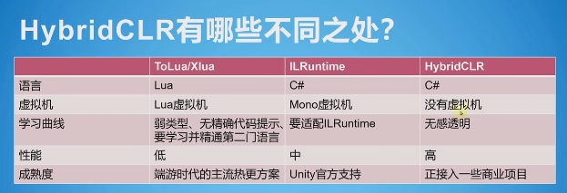

https://blog.csdn.net/Raymond_King123/article/details/126424844

不同之处：

  

如果想用使用HybridCLR热更，那么在选择打包模式时，脚本后台就不能用默认的Mono方式来进行打包，必须切换到IL2CPP方式。
使用IL2CPP方式进行打包后，如果打的是安卓包，那么你就会看到一个libil2cpp.so文件，这个文件里存储的是最终编译出的代码
